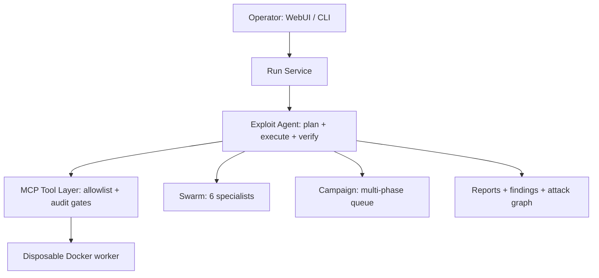

# BreachPilot

Open-source autonomous security-testing operator for authorized environments. Plans, executes, verifies, and reports full assessment lifecycles with evidence — target-locked, sandboxed, and audited.

[](https://github.com/braydos-h/BreachPilot/actions/workflows/ci.yml)


[](https://github.com/braydos-h/BreachPilot/releases)

**[Quick start](#quick-start) · [Documentation](docs/README.md) · [Architecture](#how-it-works) · [Safety model](#safety-and-containment) · [Reliability metrics](docs/reliability-metrics.md) · [Live demo](https://breachpilot-site.vercel.app/)**


> [!WARNING]
> **Authorized testing only.** Only test systems you own or have explicit written permission to assess. Run the operator from an isolated, throwaway machine or VM.

## What is BreachPilot?

BreachPilot is an agentic penetration-testing operator. Given an authorized target, it runs the full loop — reconnaissance, exploitation, privilege escalation, lateral movement, verification, and reporting — through a WebUI mission-control interface or a scriptable CLI.

It is built for lab and sanctioned-assessment use: every action executes inside defined authorization boundaries, every finding requires stored-probe evidence, and every step lands in a tamper-evident audit trail.

Linux is the primary platform (full tool arsenal). Windows is installer-supported with a Python-only fallback.

## Why BreachPilot?

Auditable, evidence-driven autonomous security testing — scope → containment → verification → provenance → operator graph. See [positioning](docs/positioning.md) and [reliability metrics](docs/reliability-metrics.md) (baseline in progress — methodology here).

- **Full lifecycle, not just scanning.** Recon → exploit → post-exploitation → verified findings → MITRE-mapped reports, in one run.
- **Evidence decides, not agent claims.** Findings are independently re-proven with stored probes (`VERIFIED` / `HOLDING` / `INCONCLUSIVE`). Execution success and evidential success are tracked separately.
- **Contained by default.** Target allowlist plus mission scope gate plus disposable Docker worker with default-DROP network containment. Fail-closed: sandbox failures block execution, never fall back silently.
- **Multi-agent when it helps.** A six-specialist swarm for single high-value targets, and a persistent campaign orchestrator for multi-target, multi-phase operations.
- **Extensible without forking.** Auto-discovered MCP tools, advisory skills, attack modules, and a plugin system with a reference example. Inventory counts live in the generated appendix (`docs/generated/capability-counts.json`), never the headline.

## Quick start

Requires Python 3.11+, Docker Engine, and nmap. `bp --doctor` verifies everything, including the active AI provider.

### Linux (primary)

Release path (recommended, pinned + verified):

<!-- INSTALLER-VERSION: managed by scripts/bump-version.py (do not hand-edit the version below) -->

```bash
curl -fsSLO https://github.com/braydos-h/BreachPilot/releases/download/v0.68.4/install-v0.68.4.sh
curl -fsSLO https://github.com/braydos-h/BreachPilot/releases/download/v0.68.4/install-v0.68.4.sh.sha256
bash scripts/verify-installer.sh install-v0.68.4.sh install-v0.68.4.sh.sha256
less install-v0.68.4.sh
bash install-v0.68.4.sh
bp --doctor
bp   # opens the WebUI at http://127.0.0.1:8765
```

After an update (`git pull`), refresh the built interface with `bp --rebuild` (combine with `bp --web` to rebuild before serving).

Dev path (mutable `main`, dev-only with warning):

```bash
curl -fsSL https://raw.githubusercontent.com/braydos-h/BreachPilot/main/install.sh | bash  # dev-only
```

From an existing checkout: `./install.sh`, or `make install && make doctor && make run`. Full options: `docs/deployment.md`.

### Windows (secondary)

Windows runs Python-only exploits (no Kali arsenal). Docker Desktop with WSL2 is recommended so the default-on sandbox works.

```powershell
git clone https://github.com/braydos-h/BreachPilot.git
cd BreachPilot
powershell -ExecutionPolicy Bypass -File .\install.ps1
```

Save-and-inspect applies here too: download `install.ps1`, review it, then execute. Never `irm ... | iex`. See `docs/deployment.md`.

### First authorized run

Start with the safe built-in smoke test — localhost only, no target to invent:

```bash
bp --self-test   # safe localhost check against 127.0.0.1
```

Then run against your own lab target (example uses a placeholder address — substitute a host you own or are contracted to test):

```bash
bp --target 10.0.0.50 --mode recon                 # read-only recon first
bp --target 10.0.0.50 --mode attack                # full assessment
bp --target 10.0.0.50 --mode attack --swarm        # swarm decomposition
```

For reproducible evaluation, the repo ships oracle-graded targets (`eval_targets/`: DVWA, Juice Shop, Metasploitable 2, and others) with `bp --eval` and sandboxed `bp --benchmark` suites. See `docs/evaluation.md` and `docs/benchmarks.md`.

Artifacts land in `reports/<run_id>/` and `exploit_workspace/<target>/`.

## How it works



The WebUI/CLI submits runs to the run service, which drives the exploit agent. The agent calls gated MCP tools (recon, attack modules, Metasploit, web scanners, credentials, browser), optionally fanning out to the swarm or campaign orchestrators. Attack commands execute inside a per-run disposable container; results return as evidence-linked findings and reports.

Details: `docs/architecture.md`, `docs/runtime-flows.md`.

## Core capabilities

### Reconnaissance

Parallel TCP discovery, service fingerprinting, OS detection, and vulnerability enrichment (NVD + EPSS + CISA KEV + OSV + GHSA). Domain-aware: subdomain enumeration, DNS recon (AXFR/DNSSEC), vhost discovery, takeover flags. Nmap privilege fallback keeps firewalled hosts from wasting time.

### Exploitation and chaining

Fifteen attack-module families (web/SQLi/XSS/upload, auth, JWT/crypto, deserialization, SMB, SSH, services, privesc, AD, persistence, supply chain, ICS/IoT, and more) with capability-aware planning — each module declares prerequisites so the planner composes chains dynamically. Payload crafting and mutation, Metasploit bridge (Linux full arsenal; Windows Python-only), and web scanners (nikto, nuclei, sqlmap, gobuster, feroxbuster, whatweb, wpscan).

### Verification

Findings carry stored verification probes. `verify_finding` re-executes the probe N times; `retest_finding` re-checks confirmed findings later (`STILL_OPEN` / `FIXED` / `INCONCLUSIVE`). Optional kill-chain state machine advances stages only on passed probes. See `docs/outcome-evidence.md`.

### Multi-agent orchestration

Six specialists (recon, vuln, exploit, post-exploit, critic, reflection) share a blackboard with parallel dispatch for single high-value targets (`--swarm`). The campaign orchestrator drives persistent multi-phase queues with resume and checkpoints across targets. Same authorization boundaries either way. See `docs/swarm.md`, `docs/campaign.md`.

### Post-exploitation

Encrypted credential vault, Impacket-based lateral execution, Kerberoast, hash cracking (hashcat/john), AD attack paths (BloodHound CE, AS-REP roast, pass-the-hash, ADCS), and persistent beacons. ICS/IoT modules are read-only by default; writes are dual-gated. Web and browser testing runs through a sandboxed Playwright agent (mutating actions stay behind a config gate).

### Reporting and integrations

Markdown + HTML reports with timelines, CVSS, exploit chains, loot tables, and attack-graph evidence; MITRE ATT&CK Navigator export; Jira/GitHub issue creation. Plugin system (`plugins/`, e.g. Shodan, ZAP, Sliver, SpiderFoot) adds tools and enrichment — off by default (opt in via `plugins.enabled`), most require their own API keys. See `docs/plugin-development.md`.

### Tool and knowledge layer

The agent draws on a generated [MCP tool catalog](docs/mcp/tool-catalog-generated.md) (gated, auto-discovered tools across recon, exploitation, credentials, browser, verification, and orchestration families) and a generated [skill catalog](docs/skills/catalog.md) (advisory `SKILL.md` playbooks with deterministic + semantic selection, mid-run re-selection, and cross-mission memory). Counts change as tools and skills are added — the linked catalogs are authoritative, not this paragraph.

## Autonomy model

Execution is **autonomous within configured authorization boundaries**, while findings and other explicitly gated operations can use **human approval**. Concretely:

| Concern | Behavior |
|---|---|
| Execution authorization | Recon mode is `read_only` (gathers and proposes, never attacks). Attack mode is `full_access`: in-scope actions are auto-approved — every offensive step does **not** ask for confirmation. |
| Target/scope enforcement | Always on. The target-IP allowlist (IP, domain, `*.wildcard`, CIDR) blocks off-allowlist destinations at the MCP tool layer; the mission scope gate denies forbidden actions/assets with a `SCOPE_DENIED` audit row. |
| Operator decisions | Optional finding approval: agents can `propose_finding` (`PROPOSED`); a human approves or rejects in the WebUI Evidence tab before it becomes a finding. Goal risk tiers (`SAFE`/`GATED`/`HIGH`) and opt-in gates (kill-chain, snapshots, browser mutations) add further decision points. |
| Evidence verification | Independent of agent claims. Stored probes are re-executed; only passing probes confirm findings. |

## Safety and containment

> Commands are scope-checked at the application layer, while the sandbox network boundary independently enforces the effective destination allowlist.

- **Authorized targets only.** The allowlist is the scope authority: anything not explicitly allowed is `BLOCKED` at the tool layer, regardless of what a command or prompt says. Static command-string inspection is best-effort (dynamically constructed, DNS-resolved, or sub-interpreter destinations may not be visible) — the sandbox egress firewall below is the containment authority.
- **Mission scope gate.** `forbidden_actions` / `disallowed_assets` deny with an auditable `SCOPE_DENIED` row. Recon stays scope-gated even in attack mode.
- **Disposable worker.** Attack commands run in a per-run Docker container (non-root, capability-dropped, read-only rootfs, resource limits), destroyed afterward. Build it once: `docker build -t breachpilot-sandbox:latest docker/sandbox`.
- **Network containment, fail closed.** An ephemeral firewall in the worker's network namespace authorizes only the effective allowlist. Sandbox failures deny execution with structured `SANDBOX_*` errors — native host execution requires explicit, separate opt-in and is developer-only.
- **Tamper-evident audit.** Every action lands in a SHA-256-chained JSONL audit trail with loot, credentials, and graph evidence.

Full model, threat model, and residual risks: `docs/safety-model.md`, `docs/sandbox.md`.

## WebUI

Mission control at `http://127.0.0.1:8765` (loopback-only, token-authenticated, real-time event stream). Operator workflows: configure and launch runs, monitor live execution, inspect evidence and recon, explore attack graphs, review loot and credentials, triage proposed findings, browse skills and modules, run benchmarks, and manage system configuration — no YAML editing required. Dev hot-reload: `cd webui && npm install && npm run dev`. Reference: `docs/webui.md`, `docs/api.md`.

## Configuration and AI providers

Everything lives in `config.yaml` (validated against a schema), editable from the WebUI System pages. Providers are pluggable (`ollama`, `opencode_go`, `chatgpt`) — `bp --doctor` probes only the active one, and embeddings are a separate optional layer. Model routing, browser agent, sandbox, API concurrency, and benchmark suites are all config-driven. Key reference: `docs/config-reference.md`; providers: `docs/providers.md`.

API keys (`OPENCODE_GO_API_KEY`, `OLLAMA_API_KEY`, optional NVD/GitHub/SerpAPI keys) live in the environment or gitignored `secr.json`. `bp --setup-api-keys` walks through setup.

Data residency: loopback Ollama keeps prompts on-box (`local`); Ollama Cloud, OpenCode Go, and ChatGPT send prompts + target data off-box (`cloud`) — the WebUI badges each provider and asks for explicit acknowledgement before a cloud route is used. Boundary table: `docs/providers.md#data-residency--privacy-boundary`.

## Evaluation and quality

- **Tests:** mocked pytest suite (no live Nmap) covering scope gates, recon, swarm, audit chains, credentials, and Metasploit. Run one file at a time per repo policy (see `AGENTS.md`).
- **CI:** pytest matrix (Python 3.11–3.13), coverage, CodeQL, dependency review on every push/PR.
- **Lint/types:** `ruff check .` and `ruff format --check .` must be clean; `mypy` over `tools/`; WebUI via `tsc`, `vite build`, and `vitest`.
- **Regression:** `bp --eval` (oracle-graded targets) and `bp --benchmark` (sandboxed suites) with `--save-baseline` / `--check-regression` gates, surfaced in the WebUI Benchmarks page and nightly workflows.

```bash
python3 -m pytest tests/test_scope_gate.py -v -p no:cacheprovider -n 0
ruff check . && ruff format --check .
mypy --follow-imports=skip tools
```

See `docs/testing-guide.md`, `docs/evaluation.md`, `docs/benchmarks.md`.

## Documentation

| Topic | Links |
|---|---|
| Start here | [Getting Started](docs/getting-started.md) · [Tutorial](docs/tutorial.md) · [CLI Reference](docs/cli-reference.md) · [Glossary](docs/glossary.md) |
| Design | [Architecture](docs/architecture.md) · [Runtime Flows](docs/runtime-flows.md) · [Safety Model](docs/safety-model.md) · [Sandbox](docs/sandbox.md) |
| Operating | [WebUI](docs/webui.md) · [API](docs/api.md) · [Deployment](docs/deployment.md) · [Config Reference](docs/config-reference.md) |
| Capabilities | [Attack Modules](docs/attack-modules.md) · [Swarm](docs/swarm.md) · [Campaign](docs/campaign.md) · [MCP Tools](docs/mcp-tools.md) · [Providers](docs/providers.md) · [Skills](docs/skills.md) |
| Assurance | [Evaluation](docs/evaluation.md) · [Benchmarks](docs/benchmarks.md) · [Testing Guide](docs/testing-guide.md) · [Release Checklist](docs/release-checklist.md) |

Full index (40+ guides): `docs/README.md`.

## Contributing

1. Read `AGENTS.md` (test-run rules and frozen-file constraints are mandatory).
2. Run `bp --doctor && bp --self-test` after safety-area changes.
3. Before a PR: one test file at a time, then `ruff check .`, `ruff format --check .`, `mypy --follow-imports=skip tools`, plus the WebUI build/tests. CI repeats all of this plus CodeQL. Release sign-off additionally requires every gate in `docs/release-checklist.md`.
4. Never edit frozen Flow B files (`scope_gate.py`, `safety_reviewer.py`, `legacy/`). Root Flow B shims warn on import (removal in 0.71); canonical imports are `legacy.*` — see `legacy/README.md`. New MCP tools: add `@audit_tool` / `@require_allowlist()` in `tools/mcp_tools/<family>.py` — registration is automatic.

## License

Apache 2.0. See [LICENSE](LICENSE). Repository: [github.com/braydos-h/BreachPilot](https://github.com/braydos-h/BreachPilot).
