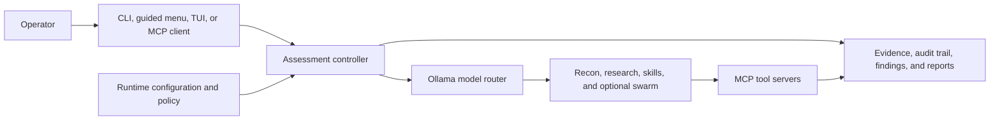

# NetAttackAI

> **AI-assisted assessment operations for authorized security work — from first signal to evidence-backed report.**

**Beta · GPL-3.0-only · Python 3.11+ recommended · Ollama-backed**

NetAttackAI is a local-first Python workspace for authorized security assessments. It brings reconnaissance, model-guided investigation, specialist-agent collaboration, evidence capture, audit artifacts, and reporting into one operator-controlled workflow — without reducing the engagement to a pile of scan output.

> **Authorized environments only.** The shipped runtime profile is a **lab build**: attack mode is enabled with `full_access`. Its runtime target lock is useful, but it is not a sandbox, a substitute for written authorization, or a production-safe default. Run it only on a disposable operator host and against systems you own or are explicitly authorized to assess.

## Why NetAttackAI

| What you need | What NetAttackAI brings |
| --- | --- |
| **Context, not just alerts** | Recon-first assessment, service enrichment, CVE research, goal suggestions, runtime skills, and model-guided next steps. |
| **One place to operate** | A guided terminal menu, a Textual dashboard with missions, tasks, findings, evidence, reports, targets, graphs, memory, logs, and swarm state, plus direct CLI control. |
| **A team of focused agents** | An optional six-role swarm for recon, vulnerability analysis, exploitation, post-exploitation, critique, and reflection — coordinated through a shared blackboard and battle log. |
| **Work you can explain later** | Evidence storage, SQLite-backed missions and tasks, finding verification, audit trails, resumable sessions, timelines, and report export. |
| **Your tooling, your control plane** | Ollama model routing, MCP servers, Nmap integration, optional security-tool integrations, configurable runtime skills, and operator-visible configuration. |

## Start here

### Requirements

- **Python 3.11+** for the documented path. The package metadata accepts Python 3.10+, but the built-in `--doctor` check requires 3.11+.
- **Ollama** running at `http://localhost:11434`. The default configuration selects `glm-5.2:cloud`; `nomic-embed-text` powers semantic-memory features.
- **Nmap** on `PATH` (or configure `nmap.path` in [`config.yaml`](config.yaml)). On Linux, privileged scan features may need root or `nmap.sudo: true`; the app can downgrade those flags when unprivileged.
- Optional tools such as Metasploit, Exploit-DB/searchsploit, tmux, Hydra, and Impacket unlock additional lab workflows. They are informational rather than mandatory in diagnostics.

### Manual installation

Use this portable path if you want to control every host change yourself.

```bash
# Linux / macOS
python3 -m venv .venv
source .venv/bin/activate
python -m pip install --upgrade pip
python -m pip install -r requirements.txt

# Install or verify the models you plan to use.
ollama pull glm-5.2:cloud
ollama pull nomic-embed-text

# Diagnose the environment, then run the localhost-only, read-only smoke test.
python main.py --doctor
python main.py --self-test
```

On Windows PowerShell:

```powershell
python -m venv .venv
.\.venv\Scripts\Activate.ps1
python -m pip install --upgrade pip
python -m pip install -r requirements.txt
python main.py --doctor
python main.py --self-test
```

`--doctor` checks every model alias listed in [`config.yaml`](config.yaml), so it will report aliases you have not installed. Pull the models you intend to use or trim the model registry before treating the diagnostic as a complete pass.

### Optional host bootstrap (Linux / macOS)

The installer is convenient, but intentionally substantial: it may install OS packages and optional Kali tooling, install/start Ollama, pull models, create a virtual environment, and add a `natai` launcher to `~/.local/bin`. Review it before running it on any machine you care about.

```bash
bash install.sh

# Open a new terminal after the installer updates PATH, then:
natai --doctor
natai --self-test
natai
```

For a lighter bootstrap, skip optional Kali packages, model downloads, or the PATH launcher:

```bash
INSTALL_KALI_TOOLS=0 SKIP_MODEL_PULL=1 ADD_TO_PATH=0 bash install.sh
```

### Your first safe session

```bash
# Hard-coded to localhost and read-only; writes JSON + Markdown diagnostics under reports/.
python main.py --self-test

# Guided terminal experience.
python main.py

# Full Textual operations dashboard.
python -m tui

# Recon-first assessment — replace only with an authorized lab IP.
python main.py --target <AUTHORIZED_LAB_IP> --mode recon --recon-first
```

The last command preserves the ready-to-begin confirmation gate. Do not use `--yes` as a shortcut around your own engagement checks.

## From target to report



NetAttackAI has two complementary workflows:

- **Modern assessment engine** — [`main.py`](main.py) and [`app.py`](app.py) run the asynchronous, MCP-based experience behind the menu, direct CLI, dashboard, swarm, persistent sessions, and reporting.
- **Research workflow** — [`cli.py`](cli.py) provides a deterministic, SQLite-backed mission/task/finding/report pipeline with explicit mission scope and risk controls.

That separation is deliberate. The modern engine is the operator-facing campaign surface; the research workflow is a structured, headless-friendly system of record.

## What makes the workflow different

### Recon that feeds the next decision

Start with target discovery and service intelligence, then turn the output into rated goals and focused follow-up work. The recon pipeline, goal suggester, CVE intelligence, and runtime-skill selection keep context attached to the assessment rather than making the operator stitch tools together by hand.

### Agent assistance with an operator in the loop

Choose a model alias, use a guided goal, or bring a custom goal. When the job is complex, enable the specialist swarm, critic, reflection, adaptive strategies, advisory peer-model consultation, or long-session checkpoints. The controls are exposed as runtime settings rather than hidden behind a black box.

### Evidence that survives the session

NetAttackAI records tasks, observations, target relationships, raw evidence, findings, model telemetry, session state, and audit events. Reports can capture timelines, CVSS context, vulnerability chains, and exportable finding data — giving a team something reviewable at the end of a run.

### A real operations surface

The Textual TUI exposes the whole engagement: mission setup, scope, targets, task execution, findings, evidence, reports, logs, target graph, memory, settings, runtime skills, and swarm status. Use it when terminal output alone stops being enough.

## Configure deliberately

There are two configuration boundaries. Use the right one for the workflow you are running.

| File / command | Purpose |
| --- | --- |
| [`config.yaml`](config.yaml) | Modern `main.py` runtime: Ollama/model routing, MCP transport, Nmap, execution permissions, target allowlists, workspaces, swarm, memory, skills, and reporting behavior. |
| [`mission.yaml`](mission.yaml) | Legacy `cli.py` workflow: program objective, allowed/disallowed assets, risk profile, forbidden actions, rate limits, accounts, and testing modes. |
| [`.env.example`](.env.example) | Reference for provider and runtime environment variables. It is **not automatically loaded**; export values in your shell or source it deliberately. |
| `python main.py --setup-api-keys` | Interactively writes configured provider keys to ignored local `secr.json`. |

Before any non-localhost assessment:

1. Put the written engagement rules in the appropriate configuration file.
2. Review `exploit.permission`, `exploit.attack_mode`, `exploit.require_explicit_allowlist`, and `exploit.allowed_targets` in [`config.yaml`](config.yaml).
3. Pass exactly one authorized target via `--target`; the modern MCP path injects that runtime target into its allowlist.
4. Verify the run summary and keep the confirmation gate enabled.

The current stock `config.yaml` sets `permission: full_access` and `attack_mode: true` for lab use. Treat it as powerful operator tooling, not as a safe baseline for a real network.

### Provider keys and external services

NetAttackAI can use `NVD_API_KEY`, `OLLAMA_API_KEY`, and `SERPAPI_API_KEY` where configured. Environment variables are read from the shell; an `.env` file is only a reference until you explicitly source it. The local key setup flow stores values in gitignored `secr.json`.

Ollama is local to the operator host, but the default model name ends in `:cloud`. Review the model registry and provider settings before making any data-residency or offline-use claim for your deployment.

## Safety model and trust boundaries

This project deliberately distinguishes **recon/research safeguards** from the **lab attack path**.

- The database-backed research workflow uses mission scope, risk, rate, and action gates.
- Recon mode is read-only/propose-only and includes a post-recon safety review.
- The modern attack path is target-locked through its MCP allowlist. The runtime `--target` is injected into that allowlist, and target-touching MCP tools validate destination targets.
- In the stock lab profile, attack mode has `full_access`; it can drive powerful tooling from the operator host. The target lock does not make that host disposable, inspect commands for safety, or confer authorization.
- The project records JSONL audit data and hashes generated code, while evidence and reporting workflows preserve assessment artifacts.

For the precise control model, known limits, and development rules, read [Safety Model](docs/safety-model.md) before enabling attack workflows. If you need a production-safe baseline, do not start from the stock attack configuration — create and review an engagement-specific configuration first.

## Common commands

| Command | When to use it |
| --- | --- |
| `python main.py` | Launch the guided terminal menu. |
| `python main.py --tui` or `python -m tui` | Launch the Textual dashboard. |
| `python main.py --doctor` | Inspect Python, dependencies, Nmap, Ollama, model aliases, config, workspace, and ports. |
| `python main.py --self-test` | Run the localhost-only read-only smoke test and save diagnostic artifacts. |
| `python main.py --skills-list` | Inspect the runtime-skill catalog without starting a session. |
| `python main.py --target <AUTHORIZED_LAB_IP> --mode recon --recon-first` | Run an authorized recon-first assessment. |
| `python main.py --swarm --critic --reflection` | Add specialist-agent collaboration and review to a compatible direct run. |
| `python main.py --long-session --resume <RUN_OR_SESSION_ID>` | Use checkpointed, resumable long-session operation. |
| `python main.py --help` | View the complete, source-of-truth CLI reference. |

### Legacy research workflow

The deterministic workflow writes its SQLite data under `research_workspace/` and is a good fit for explicit mission/task management or headless automation.

```bash
python cli.py init-mission --config mission.yaml
python cli.py list-scope
python cli.py next-task
python cli.py run-task T-00001
python cli.py list-findings
python cli.py generate-report F-00001
python cli.py status
```

### MCP surfaces

<<<<<<< Updated upstream
NetAttackAI includes a defensive, scope-aware MCP server and a separate exploit MCP server for the modern engine. Both default to stdio; start them explicitly when integrating from another MCP client.
=======
All behavior-defining settings live in **`config.yaml`**. Mission scope (allowed /
disallowed assets, forbidden actions, risk profile, testing modes, rate limits) lives
in **`mission.yaml`**, loaded by `cli.py` / `mission.py`.

Important `config.yaml` defaults (lab build):

- `exploit.permission: full_access` — lab attack posture (recon still resolves to
  `read_only` via the missing-key fallback).
- `exploit.attack_mode: true`
- `exploit.require_explicit_allowlist: true` — the runtime `--target` is unioned in via
  `EXPLOIT_TARGET`; this is the target-IP lock.
- `exploit.allowed_targets: []`
- `swarm.enabled: true`
- `memory.semantic_enabled: true`
- `ollama.model: glm-5.2:cloud` (976K context)

Provider API keys are read from env vars referenced in `config.yaml`
(`NVD_API_KEY`, `OLLAMA_API_KEY`, `SERPAPI_API_KEY`, and the optional
`GITHUB_TOKEN` that lifts the `cve_to_poc` GitHub Search API rate limit from
60/hr to 5000/hr); see [`.env.example`](.env.example).
A local key file (`secr.json`, gitignored) can be populated via
`python main.py --setup-api-keys`.

## CLI reference

| Flag | Purpose |
|------|---------|
| `--target <ip>` | Target IP to recon or attack. |
| `--mode {recon,attack}` | `recon` = gather intel, `attack` = full exploitation. |
| `--goal <name>` | Preset goal (`backdoor`, `initial_access`, `privilege_escalation`, …). |
| `--custom-goal <text>` | Custom goal description. |
| `--recon-first` | Recon-then-attack flow. |
| `--tui` / `--menu` | Launch the TUI dashboard / force the interactive menu. |
| `--swarm` | Enable multi-agent swarm mode. |
| `--critic` / `--reflection` | Critic pre-approval / reflection agent (require `--swarm`). |
| `--adaptive-exploits` | Adaptive exploit selection. |
| `--long-session` | Opt-in multi-hour attack mode with crash-safe resume. |
| `--model <alias>` | Override default model alias (`glm`/`kimi`/`deepseek`/`deepseek_flash`/`minimax`). |
| `--mcp-transport {stdio,http}` | Exploit MCP transport. |
| `--skills {on,off,hints,lookup}` | Runtime skills mode. |
| `--multi-model-consult` | Enable advisory peer-model consultation. |
| `--exploit ...` | Standalone exploit subcommand (`--exploit-target`, `--exploit-cve`, `--exploit-permission`). |
| `--doctor` / `--self-test` | Environment diagnostics / safe localhost smoke test. |
| `--resume` | Resume from a prior session's checkpoint. |
| `--version` | Print version and exit. |

## Safety & scope model

- **Recon** is fully scope-gated and propose-only (`read_only`): the agent gathers intel
  and proposes attacks without executing them. A post-session `SafetyReviewer` runs on
  every tool call.
- **Attack** is **target-locked**: the AI may do whatever it takes to the one target IP,
  but cannot pivot to other hosts. The lock is enforced at the MCP tool layer by
  extracting every destination (URL authorities, `/dev/tcp` hosts, LHOST/RHOST, scanner
  targets, bare IPs) and refusing any not in the allowlist (`exploit.allowed_targets`
  ∪ the runtime `--target`).
- **Three permission levels** (`tools/exploit_agent/policy.py`): `full_access` (lab),
  `approve_only` (every action needs `ALLOW <ip>`), `read_only` (propose only).
- **Hard-forbidden actions** regardless of config (`scope_gate.py`): denial of service,
  destructive exploit, social engineering, physical attack, malware, credential theft.
- **Full JSONL audit trail** (`exploit_audit.jsonl`) with SHA256 of generated code.

See [`docs/safety-model.md`](docs/safety-model.md) for the full scope/risk/permission
model and secure-development rules.

## Project layout

```
main.py / app.py        assessment controller (Flow A entry points)
cli.py                  legacy research CLI (Flow B entry point)
mcp_server.py           defensive, scope-gated MCP server
mcp_exploit_server.py   permissive, target-locked exploit MCP server
config.yaml             runtime configuration
mission.yaml            mission scope + risk profile
tools/                  exploit agent, swarm, autonomous orchestrator, MCP tools,
                        recon pipeline, attack modules, skills, reporting, …
tui/                    Textual TUI (18 screens)
tests/                  ~80 test files (all mock subprocess / network)
docs/                   engineering docs (architecture, flows, safety, extension, …)
skills-to-add/          curated runtime skill catalog
```

## Testing
>>>>>>> Stashed changes

```bash
python mcp_server.py --transport stdio
python mcp_exploit_server.py --transport stdio
```

The defensive server needs an allowlisted `research.allowed_assets` configuration before it will scan a target. For transport, binding, and integration details, see [Architecture](docs/architecture.md) and [Runtime Flows](docs/runtime-flows.md).

<details>
<summary><strong>Project map</strong></summary>

| Path | Role |
| --- | --- |
| [`main.py`](main.py) / [`app.py`](app.py) | Primary assessment controller and direct CLI. |
| [`cli.py`](cli.py) | Deterministic mission, task, finding, and reporting workflow. |
| [`mcp_server.py`](mcp_server.py) | Defensive, scope-aware MCP scan surface. |
| [`mcp_exploit_server.py`](mcp_exploit_server.py) | Exploit MCP wiring for the modern engine. |
| [`tools/`](tools) | Model routing, recon, skills, policy, swarm, sessions, evidence, reporting, and MCP tool implementations. |
| [`tui/`](tui) | Textual dashboard, screens, themes, widgets, and service facade. |
| [`tests/`](tests) | Focused unit and integration-style regression coverage using mocked subprocess/network behavior. |
| [`docs/`](docs/README.md) | Architecture, runtime flow, module, extension, safety, testing, and skill guides. |

</details>

## Documentation

The README is the activation guide; the deeper engineering docs live in [`docs/`](docs/README.md).

- [Getting Started](docs/getting-started.md) — prerequisites, setup, and developer loop.
- [Architecture](docs/architecture.md) — entry points, persistence, domain services, and MCP layout.
- [Runtime Flows](docs/runtime-flows.md) — recon, assessment, swarm, TUI, and report lifecycles.
- [Module Guide](docs/module-guide.md) — ownership of top-level modules, tools, TUI, and tests.
- [Extension Guide](docs/extension-guide.md) — safe edit points for new tools, integrations, configuration, and persistence.
- [Safety Model](docs/safety-model.md) — scope, permission, audit, and lab-boundary details.
- [Testing Guide](docs/testing-guide.md) — targeted tests and verification expectations.
- [Runtime Skills](docs/skills.md) — skill catalog, selection, and extension behavior.

## Develop and contribute

The test suite is organized across 82 test modules and mocks live subprocess and network behavior. Run focused checks while you work, then the full suite before sharing a change.

```bash
# Unix convenience targets
make install-dev
make test
make test-one F=tests/test_scope_gate.py

# Equivalent direct commands
python -m pip install -e ".[dev]"
python -m pytest tests/ -v
python -m pytest tests/test_scope_gate.py -v
python -m pytest tests/ -v -k "scope"
```

For safety-sensitive changes, also run `python main.py --doctor` and `python main.py --self-test`. Read the [Testing Guide](docs/testing-guide.md), [Safety Model](docs/safety-model.md), and [Extension Guide](docs/extension-guide.md) before adding a tool or a new execution path. Keep changes focused, preserve existing safety boundaries, and add regression coverage for behavior you modify.

## License

NetAttackAI is licensed under the [GNU General Public License v3.0](LICENSE).

## Responsible use

You are responsible for obtaining authorization, respecting scope and rate limits, protecting collected evidence, and complying with applicable law. The maintainers and contributors provide this software for authorized security testing and educational use only and disclaim liability for misuse.
