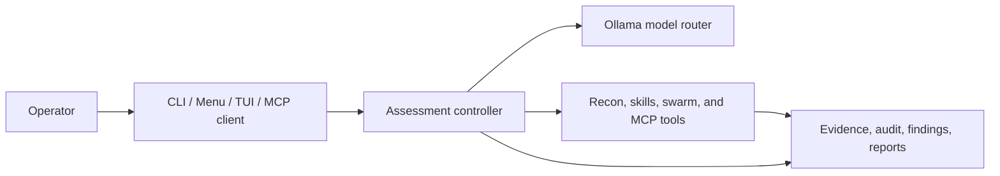

<div align="center">

# NetAttackAI

**A local-first, AI-assisted workspace for authorized security assessments.**


[Quick start](#quick-start) · [Capabilities](#capabilities) · [Safety](#authorized-use-and-safety) · [Documentation](#documentation)

</div>

NetAttackAI combines reconnaissance, model-guided investigation, evidence collection, reporting, and an operator-facing terminal UI in one Python workspace. It is designed for systems you own or are explicitly authorized to assess—not for unsanctioned testing.

> [!WARNING]
> This repository’s default `config.yaml` is a **lab profile**. Attack mode uses `full_access` on the operator host, with a runtime target allowlist as the principal network boundary. Use a disposable operator machine, define engagement-specific scope, and review the configuration before every non-local run.

## Capabilities

| Area | What it provides |
| --- | --- |
| Recon and research | Nmap-based discovery, service enrichment, CVE intelligence, web research, goal suggestions, and runtime skill selection. |
| AI-assisted operations | Ollama model routing, configurable model aliases, optional peer-model consultation, adaptive strategies, and resumable long sessions. |
| Operator experiences | Guided terminal menu, direct CLI, a Textual dashboard, and MCP servers for client integrations. |
| Assessment workflow | Missions, scope and risk controls, queued tasks, observations, target graphs, memory, evidence, findings, and Markdown reports. |
| Specialist swarm | Optional recon, vulnerability, exploit, post-exploit, critic, and reflection agents coordinated through shared state. |

## Quick start

### Prerequisites

- Python 3.11+ is recommended (the package metadata supports Python 3.10+).
- [Ollama](https://ollama.com/) running at `http://localhost:11434` for AI-backed flows.
- [Nmap](https://nmap.org/) available on `PATH` for scan features.
- The Ollama models configured in [`config.yaml`](config.yaml). The stock configuration uses `glm-5.2:cloud` and `nomic-embed-text` for semantic memory.

Optional integrations—including Metasploit, Exploit-DB/searchsploit, tmux, Hydra, and Impacket—unlock additional lab workflows. Run `--doctor` to see what is available on your machine.

### Install

```bash
git clone <your-fork-or-repository-url>
cd NetAttackAi

python3 -m venv .venv
source .venv/bin/activate
python -m pip install --upgrade pip
python -m pip install -r requirements.txt
```

On Windows PowerShell:

```powershell
python -m venv .venv
.\.venv\Scripts\Activate.ps1
python -m pip install --upgrade pip
python -m pip install -r requirements.txt
```

Pull the models you intend to use, then check the environment:

```bash
ollama pull glm-5.2:cloud
ollama pull nomic-embed-text

python main.py --doctor
python main.py --self-test
```

> [!NOTE]
> `--self-test` is restricted to localhost and runs a read-only smoke test. It writes diagnostic artifacts to `reports/`.

## Run an assessment

Start with the guided menu or the operations dashboard:

```bash
python main.py
python -m tui
```

For an authorized target, begin with recon and retain the confirmation gate:

```bash
python main.py --target <AUTHORIZED_LAB_IP> --mode recon --recon-first
```

Useful commands:

| Command | Purpose |
| --- | --- |
| `python main.py --doctor` | Check Python, dependencies, Nmap, Ollama, models, configuration, workspaces, and ports. |
| `python main.py --self-test` | Run the localhost-only, read-only smoke test. |
| `python main.py --skills-list` | View the runtime-skill catalog. |
| `python main.py --tui` | Launch the Textual dashboard from the main launcher. |
| `python main.py --swarm --critic --reflection` | Enable specialist-agent coordination and review for a compatible run. |
| `python main.py --long-session --resume <RUN_OR_SESSION_ID>` | Run or resume a checkpointed session. |
| `python main.py --help` | Show the complete CLI reference. |

### Structured research workflow

The deterministic workflow in `cli.py` keeps mission, task, finding, and report records in `research_workspace/`:

```bash
python cli.py init-mission --config mission.yaml
python cli.py list-scope
python cli.py next-task
python cli.py run-task T-00001
python cli.py list-findings
python cli.py generate-report F-00001
```

## Configure deliberately

NetAttackAI has separate configuration for its two primary workflows:

| File | Used by | Purpose |
| --- | --- | --- |
| [`config.yaml`](config.yaml) | `main.py`, TUI, and exploit MCP flow | Ollama, models, Nmap, MCP transport, skills, swarm, memory, research, workspaces, and modern-runtime controls. |
| [`mission.yaml`](mission.yaml) | `cli.py` workflow | Mission objective, allowed/disallowed assets, forbidden actions, risk profile, rate limits, testing modes, and accounts. |
| [`.env.example`](.env.example) | Optional integrations | Reference for NVD, GitHub, Ollama, and SerpAPI credentials plus runtime overrides. |

Provider values are read from the environment; `.env.example` is a template, not an automatically loaded configuration file. You can also store configured provider keys in the gitignored `secr.json` through:

```bash
python main.py --setup-api-keys
```

Before assessing anything beyond localhost, review the `exploit` section in [`config.yaml`](config.yaml), pass one explicit `--target`, and confirm the run summary. Do not use `--yes` to bypass your own authorization checks.

## Authorized use and safety

The project uses layered controls, but they do not replace written permission or sound operator judgment.

- Recon is read-only/propose-only and is followed by a safety review.
- The modern attack path injects the runtime `--target` into its MCP allowlist and validates target-touching tools against it.
- The database-backed workflow applies mission scope, action, rate, and risk gates before execution.
- Evidence, audit records, findings, session state, and reports are persisted to support review after a run.

> [!CAUTION]
> The target lock is not a sandbox. In the stock lab profile, powerful tooling can act on the operator machine and the attack path is not a production-safe default. Never treat these controls as authorization, and never run attack workflows against systems outside an explicitly approved scope.

Read the [Safety Model](docs/safety-model.md) for the full trust boundaries, permission modes, audit behavior, and development requirements.

## Architecture at a glance



The codebase also includes a structured, database-backed research loop:

```text
Mission → Scope and risk gates → Planner → Task queue → Executor/tools
        → Observer → Memory, graph, and evidence → Finding verifier → Report
```

<details>
<summary><strong>Project map</strong></summary>

| Path | Role |
| --- | --- |
| [`main.py`](main.py) | Main launcher for menu, TUI, recon, attack, diagnostics, and sessions. |
| [`cli.py`](cli.py) | Deterministic mission, task, finding, and report workflow. |
| [`mcp_server.py`](mcp_server.py) | Defensive, scope-aware MCP scanning server. |
| [`mcp_exploit_server.py`](mcp_exploit_server.py) | MCP wiring for the modern exploit runtime. |
| [`tools/`](tools) | Model routing, policy, recon, skills, sessions, reporting, swarm, and MCP tools. |
| [`tui/`](tui) | Textual application, screens, services, widgets, and themes. |
| [`tests/`](tests) | Unit and integration-style regression tests with mocked external behavior. |
| [`docs/`](docs/README.md) | Engineering and operational documentation. |

</details>

## MCP servers

Both servers use stdio by default and can be started explicitly for an MCP client:

```bash
python mcp_server.py --transport stdio
python mcp_exploit_server.py --transport stdio
```

The defensive server is the safer scan-only integration surface and requires configured scope. The exploit server exposes powerful capabilities for the modern runtime; review its policy and the safety model before connecting a client.

## Development

Install development dependencies and run the test suite:

```bash
python -m pip install -e ".[dev]"
python -m pytest
```

Run a focused test while working:

```bash
python -m pytest tests/test_scope_gate.py
```

On Unix-like systems, the [`Makefile`](Makefile) provides equivalent shortcuts such as `make install-dev`, `make test`, and `make test-one F=tests/test_scope_gate.py`.

## Documentation

- [Getting Started](docs/getting-started.md) — prerequisites, setup, and local development loop.
- [Architecture](docs/architecture.md) — entry points, persistence, services, and MCP layout.
- [Runtime Flows](docs/runtime-flows.md) — recon, assessment, swarm, TUI, and report lifecycles.
- [Module Guide](docs/module-guide.md) — ownership across modules, tools, TUI, and tests.
- [Extension Guide](docs/extension-guide.md) — safe edit points for integrations and new capabilities.
- [Safety Model](docs/safety-model.md) — scope, permissions, audits, and lab boundaries.
- [Testing Guide](docs/testing-guide.md) — focused test commands and verification expectations.
- [Runtime Skills](docs/skills.md) — skill catalog, selection, and extension behavior.
