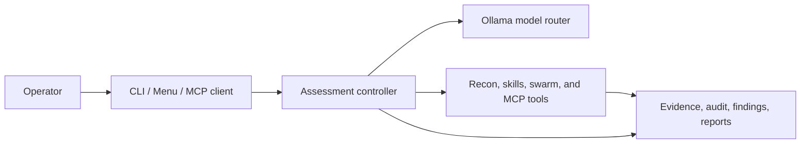

<div align="center">

# NetAttackAI

**A local-first, AI-assisted workspace for authorized security assessments.**


[Quick start](#quick-start) · [Capabilities](#capabilities) · [Safety](#authorized-use-and-safety) · [Documentation](#documentation)

</div>

NetAttackAI combines reconnaissance, model-guided investigation, evidence collection, reporting, and an operator-facing terminal UI in one Python workspace. It is designed for systems you own or are explicitly authorized to assess—not for unsanctioned testing.

> [!WARNING]
> This repository’s default `config.yaml` is a **lab profile**. Attack mode uses `full_access` on the operator host, with a runtime target allowlist as the principal network boundary. Use a disposable operator machine, define engagement-specific scope, and review the configuration before every non-local run.

## Capabilities

| Area | What it provides |
| --- | --- |
| Recon and research | Nmap-based discovery (TCP + UDP top-ports), TLS/SSL cert parsing, SMTP/DB banner parsing, off-site-bounded web spider, passive OSINT (reverse DNS, crt.sh certificate transparency, optional Shodan, IPv6 AAAA lookup), recon-run diffing, service enrichment, CVE intelligence, web research, goal suggestions, and runtime skill selection. |
| AI-assisted operations | Ollama model routing, configurable model aliases, optional peer-model consultation, adaptive strategies, and resumable long sessions. |
| OPSEC / detection-evasion | Opt-in agent self-hardening: aggression-scaled jittered pacing (STEALTH→MAXIMUM), User-Agent rotation across HTTP egress, DNS-over-HTTPS, noisy-command scoring + low-noise rewrite suggestions, and a quiet-command denylist — making `AggressionLevel.STEALTH` load-bearing. **Target-aware:** when the target IP is private/local (RFC1918/loopback/link-local/reserved/ULA, or anything in `opsec.local_cidrs`) OPSEC is forced OFF and the AI moves freely; a public-routable target keeps OPSEC ON (`opsec.local_targets_off`, default true) and the AI retains full attack autonomy (`opsec.public_autonomy`). **AI-facing (advisory, never a gate):** the system prompt carries a target-aware OPSEC posture briefing (active only for public targets), and every `run_exploit_terminal` result appends an `OPSEC_ADVISORY:` block — a live noise score for the command just run, a suggested quieter rewrite, and the pacing posture — so the AI can deliberately self-select low-noise commands. Plus detection-coverage testing: canary-action planning and a read-only audit-footprint summary. This is OPSEC hardening of the agent and detection-coverage validation, not active evasion of the target's defenses; the tamper-evident audit chain is untouched. |
| Operator experiences | Guided terminal menu, direct CLI, and MCP servers for client integrations. |
| Assessment workflow | Missions, scope and risk controls, queued tasks, evidence-grounded hypothesis judgment, target graphs, memory, findings, and Markdown reports. |
| Specialist swarm | Optional recon, vulnerability, exploit, post-exploit, critic, and reflection agents coordinated through shared state. |
| Plugin ecosystem | Opt-in, no-recompile extensions discovered from a `plugins/` directory or Python entry points. A plugin contributes attack modules, MCP tools, skill directories, and config sections through a small registration API. Plugin MCP tools must stack the same `@require_allowlist()` / `@audit_tool` safety decorators as built-ins, so the target-IP allowlist lock and audit trail apply automatically. Disabled by default; list with `--list-plugins`. |
| Pre-packaged attack modules | 76 ranked recipes the AI can dispatch via `run_attack_module` / `list_attack_modules`: web (SQLi, XSS, SSTI, GraphQL, SSRF, XXE, LFI, request smuggling, race/timing), AD/Kerberos (AS-REP roasting, kerberoasting, DCSync, LDAP enum, ADCS enum, BloodHound collection, Responder/NTLM relay, golden-ticket forge, SMB-signing check), credential amplifiers, privesc (Linux/Windows/kernel/container/cloud-IMDS/k8s, token impersonation, service-misconfig, local-exploit-suggester advisory), persistence (real SSH authorized_keys plant), ICS/SCADA/IoT enumeration (Modbus/DNP3/S7/BACnet + HMI/IoT default-cred — read-only, non-disruptive), supply-chain/CI-CD recon (exposed VCS, CI misconfig, dependency-confusion detection, artifact exposure), detection-coverage/OPSEC posture (canary probes, log-source enum, posture report — read-only), and AI-assisted CVE→exploit synthesis. Modules are ranked by service/port/CVE applicability plus a version-match bonus and cross-mission Bayesian experience. |
| Structured offensive tools | First-class MCP tools that wrap Kali scanners and crackers so the AI gets parsed output and a consistent audit record instead of raw `run_exploit_terminal` shell dumps: `run_web_scan` (nikto/nuclei/sqlmap/gobuster/feroxbuster/whatweb/wpscan/dirb/dirbuster — target-IP allowlist-locked), `run_hash_crack` (hashcat/john, local-only with auto hash-type identification and `--show` plaintext recovery), MSF recipe dispatch (`msf_run_recipe` over a named catalog — smb_version/bluekeep/psexec/local_exploit_suggester/hashdump/getsystem/handler — plus `msf_start_handler`/`msf_stop_handler` and `msf_post_hashdump`/`msf_post_getsystem`/`msf_post_portfwd`/`msf_post_route`), and an AD/Kerberos suite (`asrep_roast`, `pass_the_hash`, `adcs_enum`, `bloodhound_collect`, `responder_relay`, `smb_signing_check`, `golden_ticket`) — every target-touching tool gated by the target-IP allowlist lock. |

## Quick start

### Prerequisites

- Python 3.11+ is recommended (the package metadata supports Python 3.10+).
- [Ollama](https://ollama.com/) running at `http://localhost:11434` for AI-backed flows.
- [Nmap](https://nmap.org/) available on `PATH` for scan features.
- The Ollama models configured in [`config.yaml`](config.yaml). The stock configuration uses `glm-5.2:cloud` and `nomic-embed-text` for semantic memory.

Optional integrations—including Metasploit, Exploit-DB/searchsploit, tmux, Hydra, and Impacket—unlock additional lab workflows. Run `--doctor` to see what is available on your machine.

### Install

```bash
git clone https://github.com/braydos-h/NetAttackAi
cd NetAttackAi

python3 -m venv .venv
source .venv/bin/activate
python -m pip install --upgrade pip
python -m pip install -r requirements.txt
```

On Windows PowerShell:

```powershell
python -m venv .venv
.\.venv\Scripts\Activate.ps1
python -m pip install --upgrade pip
python -m pip install -r requirements.txt
```

Pull the models you intend to use, then check the environment:

```bash
ollama pull glm-5.2:cloud
ollama pull nomic-embed-text

python main.py --doctor
python main.py --self-test
```

> [!NOTE]
> `--self-test` is restricted to localhost and runs a read-only smoke test. It writes diagnostic artifacts to `reports/`.

## Run an assessment

Start with the guided menu:

```bash
python main.py
```

For an authorized target, begin with recon and retain the confirmation gate:

```bash
python main.py --target <AUTHORIZED_LAB_IP> --mode recon --recon-first
```

You may also target a **domain** instead of an IP — the agent resolves it, carries
both the domain and the resolved IP, and expands the attack surface via subdomain
enumeration (each discovered subdomain is auto-authorized):

```bash
python main.py --target example.com --mode attack --goal initial_access
python main.py --target example.com --mode recon --recon-first
```

Useful commands:

| Command | Purpose |
| --- | --- |
| `python main.py --doctor` | Check Python, dependencies, Nmap, Ollama, models, configuration, workspaces, and ports. |
| `python main.py --self-test` | Run the localhost-only, read-only smoke test. |
| `python main.py --skills-list` | View the runtime-skill catalog. |
| `python main.py --list-plugins` | List discovered plugins (name/version/capabilities/loaded) and exit. |
| `python main.py --swarm --critic --reflection` | Enable specialist-agent coordination and review for a compatible run. |
| `python main.py --parallel-swarm` | Enable parallel sub-agents: `route_parallel` runs same-phase recon/vuln batches concurrently, and the main AI gains `spawn_subagent`/`await_subagent`/`list_subagents` MCP tools to delegate work. Off by default (recon-first); `swarm.exploit_parallel: true` in `config.yaml` also parallelizes exploit/post_exploit. |
| `python main.py --long-session --resume <RUN_OR_SESSION_ID>` | Run or resume a checkpointed session. |
| `python main.py --eval --target <AUTHORIZED_LAB_IP>` | Run the eval/benchmark harness against a target and write `reports/eval/<run_id>/`. |
| `python main.py --help` | Show the complete CLI reference. |

### Structured research workflow

The deterministic workflow in `cli.py` keeps mission, task, finding, and report records in `research_workspace/`:

```bash
python cli.py init-mission --config mission.yaml
python cli.py list-scope
python cli.py next-task
python cli.py run-task T-00001
python cli.py list-findings
python cli.py generate-report F-00001
```

## Configure deliberately

NetAttackAI has separate configuration for its two primary workflows:

| File | Used by | Purpose |
| --- | --- | --- |
| [`config.yaml`](config.yaml) | `main.py` and exploit MCP flow | Ollama, models, Nmap, MCP transport, skills, swarm, memory, research, workspaces, and modern-runtime controls. |
| [`mission.yaml`](mission.yaml) | `cli.py` workflow | Mission objective, allowed/disallowed assets, forbidden actions, risk profile, rate limits, testing modes, and accounts. |
| [`.env.example`](.env.example) | Optional integrations | Reference for NVD, GitHub, Ollama, and SerpAPI credentials plus runtime overrides. |

Provider values are read from the environment; `.env.example` is a template, not an automatically loaded configuration file. You can also store configured provider keys in the gitignored `secr.json` through:

```bash
python main.py --setup-api-keys
```

The `eval` top-level block in [`config.yaml`](config.yaml) gates the benchmark harness defaults (the `--eval` flag still runs when `enabled` is false):

- `enabled` — eval/benchmark harness enable (gates defaults, not the flag itself).
- `output_dir` — where `reports/eval/<run_id>/` trees are written (default `reports/eval`).
- `max_rounds` — `attack_max_rounds` budget for an eval run (default 30).
- `write_markdown` — emit `eval_report.md` alongside the JSON (default true).
- `write_html` — emit `eval_report.html` alongside the JSON (default true).

Several capability blocks ship **off by default** and are opt-in under `exploit` / `recon` / `cve_lookup` in [`config.yaml`](config.yaml): `exploit.ad_kerberos` (the AD/Kerberos MCP suite — `dcsync`, `asrep_roast`, `pass_the_hash`, `adcs_enum`, `bloodhound`, `responder_relay`, `golden_ticket`; `smb_signing_check` is on by default as detection-only), `exploit.msf` (`recipes_enabled`, `auto_local_exploit_suggester`), `exploit.listeners` (extended C2 types `tls`/`dns`/`https_beacon`/`socks_pivot` — the legacy netcat/socat/http listeners stay ungated), `recon` (extended enumerators `subdomain_enum`/`vhost_discovery`/`waf_fingerprint`/`asn_whois`/`cloud_metadata_probe`/`snmp_enum`/`dns_zone_transfer`, plus `shodan_api_key_env`), and `cve_lookup.epss` / `cve_lookup.kev` (EPSS scoring and CISA KEV catalog enrichment). Each gates only its own surface; first-run behavior is unchanged.

Before assessing anything beyond localhost, review the `exploit` section in [`config.yaml`](config.yaml), pass one explicit `--target`, and confirm the run summary. Do not use `--yes` to bypass your own authorization checks.

## Authorized use and safety

The project uses layered controls, but they do not replace written permission or sound operator judgment.

- Recon is read-only/propose-only and is followed by a safety review.
- The modern attack path injects the runtime `--target` into its MCP allowlist and validates target-touching tools against it.
- The database-backed workflow applies mission scope, action, rate, and risk gates before execution.
- Evidence, audit records, findings, session state, and reports are persisted to support review after a run.

> [!CAUTION]
> The target lock is not a sandbox. In the stock lab profile, powerful tooling can act on the operator machine and the attack path is not a production-safe default. Never treat these controls as authorization, and never run attack workflows against systems outside an explicitly approved scope.

Read the [Safety Model](docs/safety-model.md) for the full trust boundaries, permission modes, audit behavior, and development requirements.

## Architecture at a glance



The codebase also includes a structured, database-backed research loop. Tool
execution and evidential outcome are deliberately separate:

```text
Mission → Scope and risk gates → Planner → Task queue → Executor/tools
        → Observer → OutcomeJudge → hypothesis state and learning
        → Memory, graph, and evidence → Finding verifier → Report
```

`OutcomeJudge` evaluates task success criteria and stop conditions only from
structured observations and persisted evidence references. A command that ran
successfully can remain evidentially inconclusive, and an execution error does
not by itself refute the hypothesis.

<details>
<summary><strong>Project map</strong></summary>

| Path | Role |
| --- | --- |
| [`main.py`](main.py) | Main launcher for menu, recon, attack, diagnostics, and sessions. |
| [`cli.py`](cli.py) | Deterministic mission, task, finding, and report workflow. |
| [`mcp_server.py`](mcp_server.py) | Defensive, scope-aware MCP scanning server. |
| [`mcp_exploit_server.py`](mcp_exploit_server.py) | MCP wiring for the modern exploit runtime. |
| [`tools/`](tools) | Model routing, policy, recon, skills, sessions, reporting, swarm, and MCP tools. |
| [`tests/`](tests) | Unit and integration-style regression tests with mocked external behavior. |
| [`docs/`](docs/README.md) | Engineering and operational documentation. |

</details>

## Workspace layout

The runtime writes to a few well-defined locations under the project root:

| Path | Contents |
| --- | --- |
| `reports/<run_id>/` | Per-run artifacts: activity log, raw/XML nmap output, host and network summaries, findings, and the exploit workspace. |
| `reports/eval/<run_id>/` | Eval/benchmark harness output: `eval_report.json` plus optional `eval_report.md` and `eval_report.html`. |
| `reports/self_test_<run_id>/` | `--self-test` diagnostic artifacts. |
| `research_workspace/<mission_id>/` | Database-backed mission data (`research.db`, evidence, reports). |
| `exploit_workspace/<target_ip>/<attempt_id>/` | Per-attempt exploit scripts, terminal/python/msf logs, and `exploit_audit.jsonl`. |
| `swarm_workspace/` | Created on demand by `main.py` for swarm runs. |

## MCP servers

Both servers use stdio by default and can be started explicitly for an MCP client:

```bash
python mcp_server.py --transport stdio
python mcp_exploit_server.py --transport stdio
```

The defensive server is the safer scan-only integration surface and requires configured scope. The exploit server exposes powerful capabilities for the modern runtime; review its policy and the safety model before connecting a client.

## Development

Install development dependencies and run the test suite:

```bash
python -m pip install -e ".[dev]"
python -m pytest
```

Run a focused test while working:

```bash
python -m pytest tests/test_scope_gate.py
```

On Unix-like systems, the [`Makefile`](Makefile) provides equivalent shortcuts such as `make install-dev`, `make test`, `make test-one F=tests/test_scope_gate.py`, and `make eval` to run the benchmark harness.

## Documentation

- [Getting Started](docs/getting-started.md) — prerequisites, setup, and local development loop.
- [Architecture](docs/architecture.md) — entry points, persistence, services, and MCP layout.
- [Runtime Flows](docs/runtime-flows.md) — recon, assessment, swarm, and report lifecycles.
- [Module Guide](docs/module-guide.md) — ownership across modules, tools, and tests.
- [Extension Guide](docs/extension-guide.md) — safe edit points for integrations and new capabilities.
- [Plugin Development](docs/plugin-development.md) — authoring opt-in plugins (attack modules, MCP tools, skills, config sections) discovered from `plugins/` or entry points.
- [Safety Model](docs/safety-model.md) — scope, permissions, audits, and lab boundaries.
- [Testing Guide](docs/testing-guide.md) — focused test commands and verification expectations.
- [Runtime Skills](docs/skills.md) — skill catalog, selection, and extension behavior.
